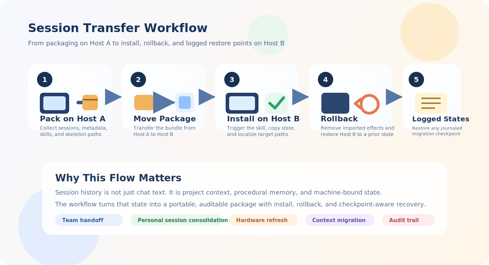
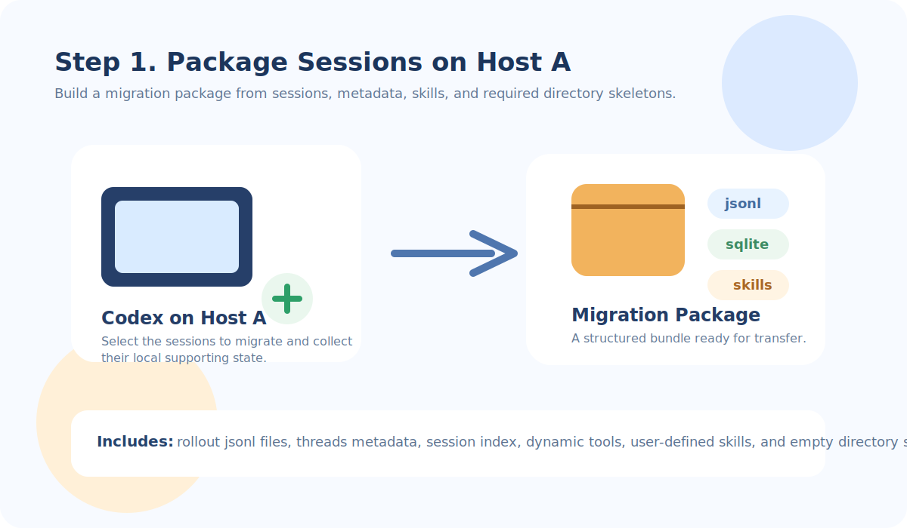
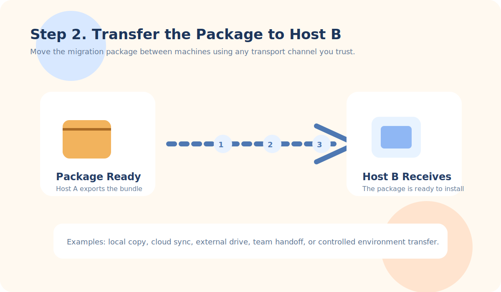
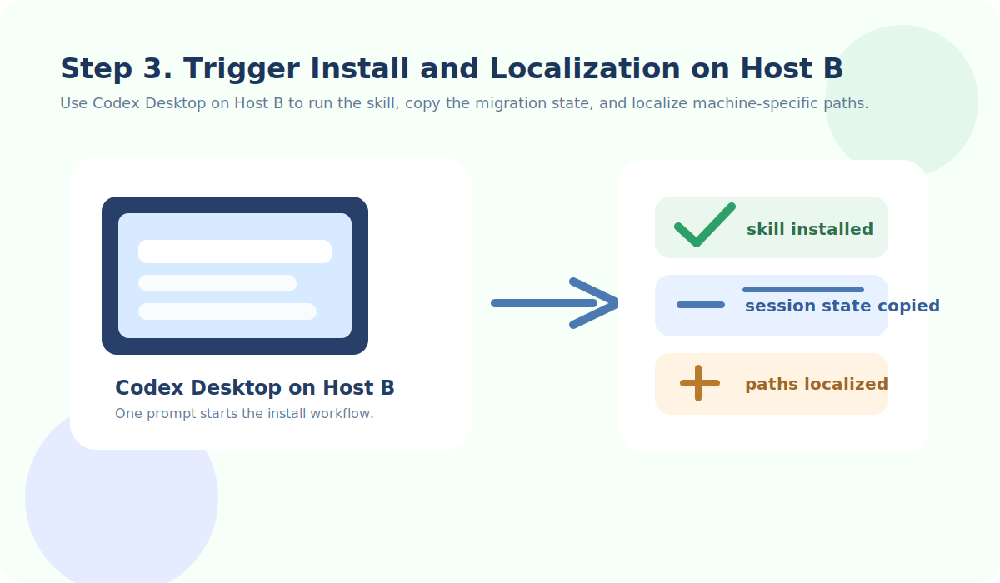
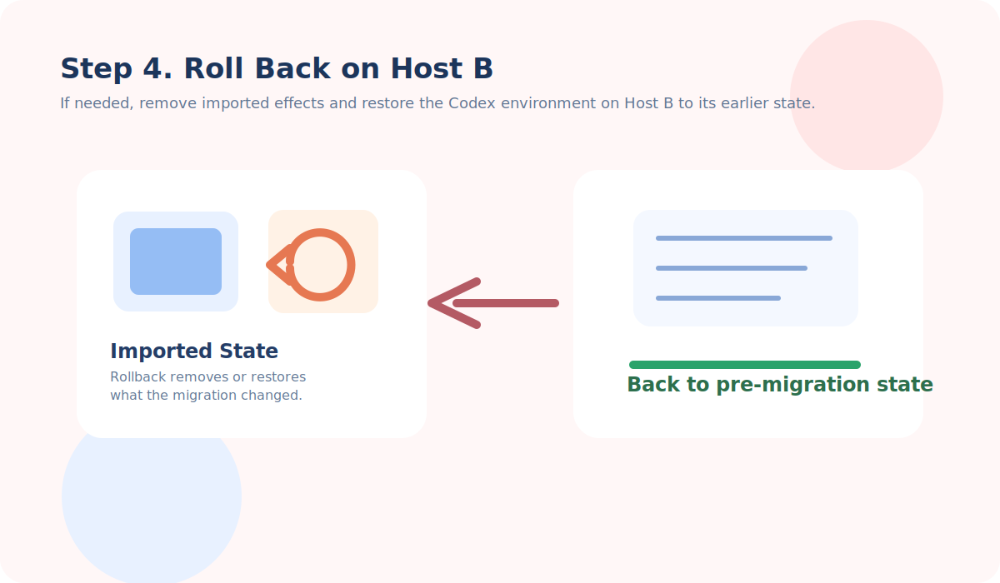
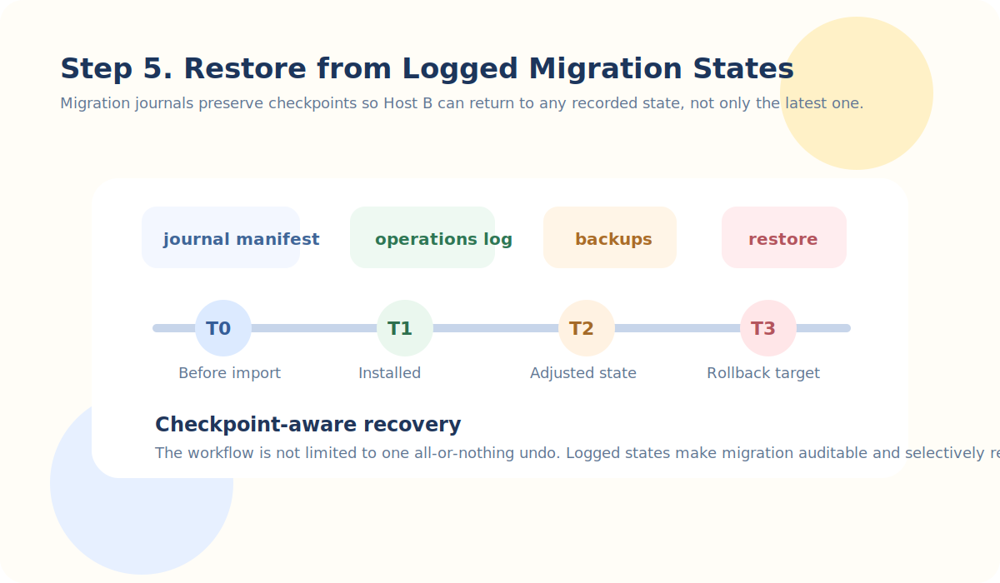

[English](./README.md) | [简体中文](./README.zh-CN.md)

# codex-session-transfer

This repository publishes `codex-session-transfer`, an open-source Codex skill for packaging, migrating, localizing, and rolling back Codex Desktop sessions.

As AI becomes more deeply integrated into traditional workflows, conversations with AI agents are turning into a new kind of asset. They capture task history, operational context, debugging paths, intermediate decisions, and reusable procedural knowledge. In practice, those session histories are becoming a new form of operational data.

The problem is that this data is often tightly bound to the local host environment where it was created. Session transcripts, local indexes, SQLite metadata, writable roots, skill dependencies, and project paths are all entangled with one machine's Codex state. As a result, moving session assets between machines comes with significant friction.

`codex-session-transfer` was developed to reduce that migration friction. It packages the minimum working set needed for session portability, localizes machine-specific paths on the destination side, and preserves enough supporting state to let imported sessions appear, open, and keep working inside Codex Desktop.

This kind of capability becomes increasingly useful in several practical scenarios: collaborative teams that want to hand off AI-assisted work across different machines, individual users who want to consolidate long-running AI session histories, hardware refresh or workstation replacement, reproducible research and engineering workflows, and broader forms of context migration where the value lies not just in files, but in the preserved decision trail around those files.

## Workflow at a Glance



### Step 1. Package on Host A



### Step 2. Transfer the Package



### Step 3. Install and Localize on Host B



### Step 4. Roll Back on Host B



### Step 5. Restore from Logged States



## What It Does

- Package the first-phase minimum working set for selected Codex sessions
- Install a session skill package onto another Codex Desktop environment
- Localize working-directory paths for the destination machine
- Record transaction logs and backups for safe rollback
- List migration transactions and roll them back when needed

## Skill Name vs Repository Name

The GitHub repository and the installable skill both use the name `codex-session-transfer`, as defined in [SKILL.md](./SKILL.md). When you install it into Codex, place the folder at:

```text
~/.codex/skills/codex-session-transfer/
```

## Repository Layout

```text
codex-session-transfer/
  SKILL.md
  agents/
    openai.yaml
  references/
    package-format.md
  scripts/
    install_session_skill_package.py
  README.md
  README.zh-CN.md
  PUBLISHING.md
  LICENSE
  .gitignore
```

## Primary Workflow

This skill provides one migration lifecycle with four actions:

- `packup`
- `install`
- `list-transactions`
- `rollback`

The main implementation lives in [scripts/install_session_skill_package.py](./scripts/install_session_skill_package.py).

## Current Scope

This repository currently focuses on the first-phase minimum working set:

- rollout `jsonl` files
- `threads`
- `session_index`
- `thread_dynamic_tools`
- user-defined skills
- required empty directory skeletons

It does not yet migrate:

- `logs_1.sqlite`
- `state_5.sqlite.logs`
- `state_5.sqlite.stage1_outputs`
- `.codex-global-state.json`

## License

This repository is released under the [MIT License](./LICENSE).
